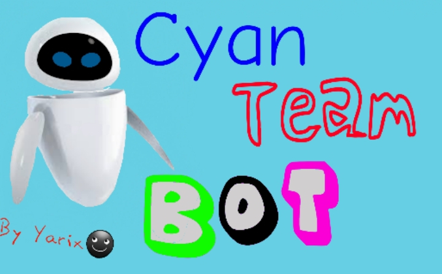

<p align="center">

</p>

</p>

<html><h1  style="text-align:center;"><font color="#573636"> BOT CREADO POR YARIX

<p align="center">
<a href="#"></a>
</p>
<p align="center">
<a href="https://github.com/Yarix963/MISTPLAY"></a>
</p>
<p align="center">
<a href="#">
</p>
<p align="center">

</p>
 CyanTeam
</p>
<br />
    Clona este repositorio</h3>
  </a>

```bash
> git clone https://github.com/Yarix963/MISTPLAY
```

## Inicia la Instalacion:

```bash
> cd MISTPLAY
> bash install.sh
```

### Para correr el bot usa:
```bash
> npm start
```

